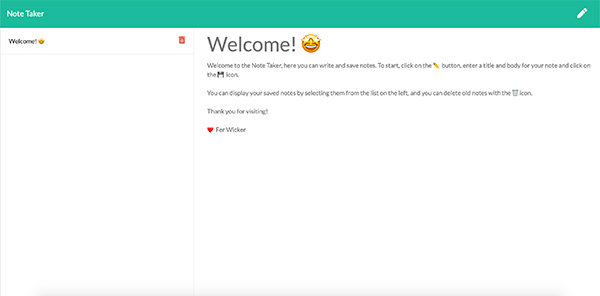

# Note Taker
Welcome to the Note Taker app! with this app you can write, save, display and delete notes with a title and body. You can visit the live version of this app or download and run with a local server.

[See deployed application.](https://ancient-scrubland-03999.herokuapp.com/)

## Table of contents
  - [Motivation](#motivation)
  - [Built with](#built-with)
  - [Features](#features)
  - [Installation](#installation)
  - [How to Use](#how-to-use)

## Motivation
This is a simple note taking application that allows you to manage your tasks and reminders with a simple interface. 

## Built With
- Javascript
- HTML
- CSS
- [Node.js](https://nodejs.org/en/)
- [Express](https://expressjs.com/)
- [npm generate-unique-id](https://www.npmjs.com/package/generate-unique-id)

## Features
- Displays saved notes in left panel
- Adding new notes when WRITE button is clicked.
- Save notes with a title and body, new notes display in left panel.
- Delete notes when no longer needed.

## Installation
To run the application on your local server: Download the package, navigate to the folder from your terminal and run the `npm install` command to install the required dependencies.

OR visit the live version [HERE.](https://ancient-scrubland-03999.herokuapp.com/)

## How to Use
### Local server:
From your terminal, navigate to the application's folder and run `node server.js`.
In your browser, go to `http://localhost:3000/`. The homepage to the app will display, click on `Get Started` to go to the Notes page.

### Deployed Application
If you are using the deployed version, simply [visit the link](https://ancient-scrubland-03999.herokuapp.com) and click on `Get Started` to go to the Notes page.

